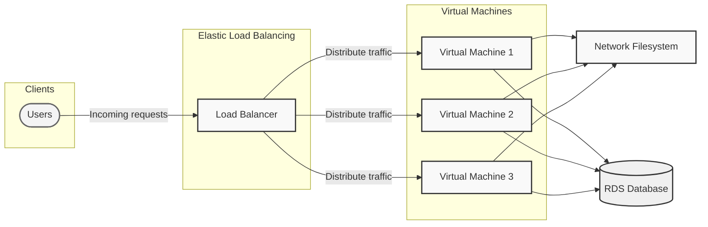

# Amazon Web Services in Action, Third Edition

https://learning.oreilly.com/library/view/amazon-web-services/9781633439160/OEBPS/Text/fm.htm
# AWS - Foundational Knowledge
Date: 2024-10-28
Tags: #foundational-knowledge #aws #hands-on 

## Overview
I'm starting my hands-on morning practice with this AWS book. I selected it, because like many books I'll use in this practice, it encourages hands-on work. We will be working in AWS. We won't cover everything, but that's ok, it's enough to get our hands active and to get some projects developed. I'm creating a repository for it right now, so I have a basic set of coding tools to work with. 

## Core Concepts
1. Cloud offers businesses flexible ways to use compute and storage that specifically fits their needs
2. [Concept 2]
3. [Concept 3]

## Notes

#### Chapter 1
Chapter 1 is a general introduction to AWS that succinctly defines the nature of the cloud and the market offerings of AWS. The first use case examined is a Web Shop owner who wants to lift-and-and shift from an on-premises data center to AWS. The authors point out the advantages of employing additional services for resiliency and greater efficiency.

The second use case is Maureen who needs to migrate an enterprise Java application to AWS. The focus on this use case is the security a virtual network provides the organization and the reduction in overhead for overall control.

The third use case is for Alexa, who works on at a startup. The focus here is on a highly available system managed through a load balancer and redundant systems. 

The forth illustration is Nick, who needs to process a large amount of data, but do it on a small budget. He does this by taking advantage of spot instances and the ability to start and stop a virtual machine on command. 

Much of the rest of this chapter is a focus on AWS as a cloud service, breaking down exactly what AWS offers users. I'm not attempting to necessarily capture that type of information in these notes, so I'll skip capture much more from Chapter 1.

#### Here's the chapter summary:
Cloud computing, or the cloud, is a metaphor for supply and consumption of IT resources.

Amazon Web Services (AWS) offers Infrastructure as a Service (IaaS), Platform as a Service (PaaS), and Software as a Service (SaaS).

AWS is a platform of web services for computing, storing, and networking that work well together.

Cost savings aren’t the only benefit of using AWS. You’ll also profit from an innovative and fast-growing platform with flexible capacity, fault-tolerant services, and a worldwide infrastructure.

Almost any use case can be implemented on AWS, whether it’s a widely used web application or a specialized enterprise application with an advanced networking setup.

You can interact with AWS in many different ways. Control the different services by using the web-based user interface, use code to manage AWS programmatically from the command line or SDKs, or use blueprints to set up, modify, or delete your infrastructure on AWS.

Pay-per-use is the pricing model for AWS services. Computing power, storage, and networking services are billed similarly to electricity.

To create an AWS account, all you need is a telephone number and a credit card.

Creating budget alerts allows you to keep track of your AWS bill and get notified whenever you exceed the Free Tier.
#### Chapter 2
Looks like we're starting our day off today 2024-10-29 creating a Wordpress server. This is what the architecture looks like that we're building:

For this we will use the following AWS resources:
- Elastic Load Balancer
- EC2 instance
- RDS for MySQL
- EFS (Elastic File System)
- Security groups

We're going to use CloudFormation for this exercise. The book includes a template. I'm using this template to get started [Cloud Formation Template](https://s3.amazonaws.com/awsinaction-code3/chapter02/template.yaml)

I'm choosing to use the CloudFormation wizard for this one and uploading the yaml file from the link. I'm naming my stack something super original like, Wordpress, and giving it a password that is not password, but something more complex. 

The password format for this is:
- Only letters (A-Z, a-z) and numbers (0-9)
- Length between 8 and 30 characters
- No special characters

Good example: `Wp7aKj9nM4xL5v2q` 

In the book, we basically skip everything else. I added tags, just because I'm trying to get in the habit of always using tags, and I'll be doing a lot of development in our environment and I want the ability to delete anything with the tag {'purpose':'learning'}

It created the Wordpress site. The rest of the chapter reviews the different resources deployed and ends on the with pricing and deleting the resources from the Stack. 

Here's a basic overview of the actual template:

1. **Network Infrastructure**
    - VPC with CIDR block 172.31.0.0/16
    - 2 Subnets across different Availability Zones
    - Internet Gateway
    - Route Tables and Network ACLs
    - Various Security Groups for components
2. **Core Components**
    - Application Load Balancer (ALB)
    - Auto Scaling Group (2-4 instances)
    - RDS MySQL Database
    - EFS (Elastic File System) for shared storage
    - EC2 instances using Amazon Linux 2 AMIs
3. **Security**
    - Separate security groups for:
        - Load Balancer
        - Web Servers
        - Database
        - EFS
    - IAM Role for EC2 instances with SSM capabilities

**Parameters**

- `WordpressAdminPassword`: Admin password (must be 8-30 characters, alphanumeric only)

**Key Features**

1. **High Availability**
    - Multi-AZ deployment
    - Auto Scaling Group with min 2, max 4 instances
    - Load balancer for traffic distribution
    - Shared EFS storage for WordPress files
2. **WordPress Configuration**
    - PHP 7.4
    - WordPress 5.8.2
    - Automated installation using wp-cli
    - Optimized PHP and opcache settings
3. **Database**
    - RDS MySQL instance
    - 5GB storage
    - db.t3.micro instance class
    - Automated backups disabled (retention period: 0)

**Resources Created**

1. Network: VPC, Subnets, IGW, Route Tables, NACLs
2. Compute: Auto Scaling Group, Launch Template
3. Storage: EFS, RDS
4. Load Balancing: Application Load Balancer
5. Security: IAM Roles, Security Groups

**Output**

- WordPress URL (accessible via the Load Balancer DNS name)

**Notable Features**

1. Rolling updates enabled for Auto Scaling Group
2. Health checks configured for instances
3. Automated WordPress installation
4. Shared file system using EFS
5. Systems Manager (SSM) integration for instance management

**Development Notes**

- Uses t3.micro instances for web servers and database (suitable for testing/development)
- Database deletion policy set to "Delete" (should be changed for production)
- Region-specific AMI mappings included for all major AWS regions
#### Chapter Summary
- Creating a cloud infrastructure for WordPress and any other application can be fully automated.
- AWS CloudFormation is a tool provided by AWS for free. It allows you to automate the managing of your cloud infrastructure.
- The infrastructure for a web application like WordPress can be created at any time on demand, without any up-front commitment for how long you’ll use it.
- You pay for your infrastructure based on usage. For example, you pay for a virtual machine per second of usage.
- The infrastructure required to run WordPress consists of several parts, such as virtual machines, load balancers, databases, and network filesystems.
- The whole infrastructure can be deleted with one click. The process is powered by automation.

## Relationships to Other Technologies/Concepts
[Mind map or list showing connections to other areas of knowledge]

## Key Takeaways
[Main points to remember about this topic]

## Potential Applications in Solutions Architecture
[Ideas on how this knowledge could be applied in your role]

## Resources for Deeper Dive
[Books, articles, or courses for further study if needed]
- [What's New](https://aws.amazon.com/about-aws/whats-new/)
- [AWS Case Studies](https://aws.amazon.com/solutions/case-studies/)

